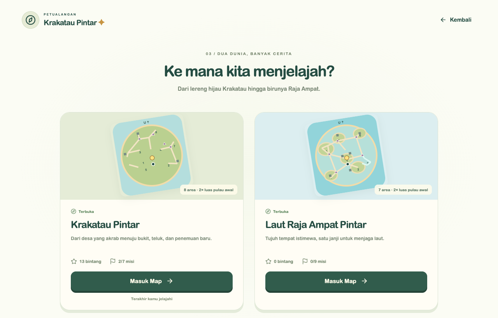
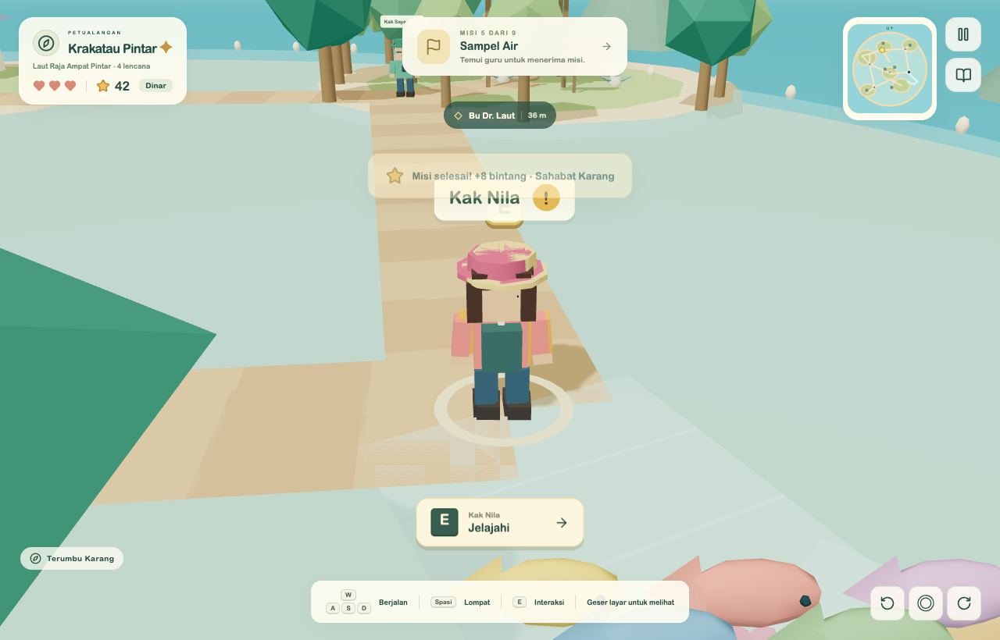
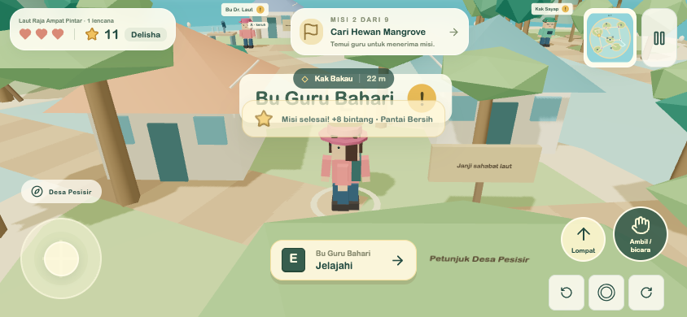

# Ekspansi dua dunia — 11 September 2026

## Dunia dan konten

Krakatau lama tetap berada pada koordinat yang sama. Radius batas berjalan awal 27 unit diperluas menjadi `27 × √2 ≈ 38,18` unit. Masing-masing map baru memiliki luas batas `πr² ≈ 4.580` unit², dua kali batas awal sekitar 2.290 unit². Total kedua map sekitar 9.161 unit² atau empat kali awal. Tes menghitung titik yang benar-benar dapat dipijak setelah collision, bukan hanya luas plane, dan memeriksa keterhubungan NPC/objektif dari spawn.

| Map | Area | Misi |
| --- | --- | --- |
| Krakatau | Desa Belajar, Pantai Sains, Hutan Bahasa, Taman Hitung Bintang, Pusat Sains | Empat misi lama dan latihan laboratorium bergilir tetap tersedia |
| Krakatau | Bukit Observasi | Mata Penjelajah: tiga pengamatan alam |
| Krakatau | Teluk Konservasi | Teluk Tanpa Sampah: kumpulkan dan pilah sampah |
| Krakatau | Jalur Gunung | Cerita Gunung Api: tiga papan di jalur aman |
| Raja Ampat | Desa Pesisir | Penjaga Laut: janji, kuis gabungan, hadiah 15 bintang dan lencana khusus |
| Raja Ampat | Pantai Bersih | Selamatkan Pantai: tiga sampah, warna/bentuk untuk Delisha, organik/anorganik untuk Dinar |
| Raja Ampat | Terumbu Karang | Hitung Ikan dan Jaga Terumbu Karang: kelompok lima ikan, hitungan sesuai usia, warna/ekosistem |
| Raja Ampat | Hutan Mangrove | Cari Hewan Mangrove dan Tiga Bibit untuk Pesisir: kepiting, burung, ikan gelodok, tiga bibit |
| Raja Ampat | Laboratorium Laut | Sampel Air: tiga sampel berlabel, kejernihan dan penjelasan |
| Raja Ampat | Pulau Burung | Sahabat Pulau Burung: tiga pengamatan, gambar/pelestarian |
| Raja Ampat | Gua Rahasia | Pola Kristal Rahasia: tiga kristal dan puzzle bentuk/pola angka |

Total: **15 area, 16 misi (7 Krakatau + 9 Raja Ampat)**, enam bintang eksplorasi tambahan, tiga NPC baru Krakatau dan enam NPC Raja Ampat. Dua belas misi ekspansi masing-masing mempunyai soal Dinar dan Delisha (24 variasi). Setiap objektif memberi satu bintang; hadiah akhir umumnya delapan bintang dan lencana. Hadiah/collectible tidak dapat digandakan. Aktivitas pengamatan mempertahankan objek di dunia; menanam mengubah petak menjadi bibit. Seluruh misi baru harus diterima dari NPC dahulu.

Landmark: menara dengan teropong, mercusuar, jalur/jembatan kayu, air terjun, dermaga/perahu, laboratorium, gua terang, sarang, dan karst jauh. Krakatau tetap pulau gunung yang diamati dari jauh dengan asap kecil dan kawah hangat. Raja Ampat memakai laguna dangkal berpagar pelampung dan jalur kaca untuk pengamatan laut; tidak ada berenang bebas atau laut dalam yang dapat dimasuki.

## Alur bermain dan penyimpanan

1. Mulai → pilih Dinar/Delisha → pilih salah satu dari tiga avatar → pilih map.
2. Krakatau selalu terbuka. Selesaikan dialog misi awal Bu Guru Sains untuk membuka Raja Ampat pada profil tersebut.
3. Pause → **Ganti map**. Kartu menampilkan pratinjau, bintang, misi, kunci, dan map terakhir.
4. Di map baru, temui guru yang ditandai minimap, terima misi, datangi objektif, lalu kembali ke guru untuk kuis/hadiah. Buku atau papan misi menampilkan status terkunci, tersedia, aktif, selesai.
5. **Lanjutkan** memuat map terakhir. Posisi kembali ke spawn; progres objektif dan hadiah tetap ada.
6. Reset dalam pengaturan/pause hanya mengosongkan map terpilih untuk anak terpilih. Reset Krakatau mengunci kembali akses Raja Ampat sampai misi awal diselesaikan lagi; data Raja Ampat tetap disimpan.

Schema `krakatau-pintar:v2` menyimpan avatar dan map terakhir per anak, serta `maps.krakatau` dan `maps["raja-ampat"]`. Masing-masing menyimpan misi aktif/selesai, tujuan yang ditandai, benda, bintang koleksi, poin, badge, area, dan putaran kuis laboratorium. `points` adalah jumlah bintang hadiah; `stars` adalah ID collectible agar tidak diberikan dua kali.

Saat hanya save `krakatau-pintar:v1` tersedia, validator lama memeriksanya lalu menyalin progres setiap anak ke map Krakatau v2. Record v1 tetap utuh sebagai cadangan. Data rusak/versi asing tidak ditimpa. Bila v2 sudah ada, v2 diprioritaskan. Data `/classic/` memakai key terpisah dan tidak disentuh. Tidak ada login, backend, transmisi profil, atau sinkronisasi cloud.

## Arsitektur dan berkas

- `src/game/maps/mapTypes.ts`, `mapRegistry.ts`, `factories.ts`: kontrak map, registry dua map, luas, factory objek/jalur/tanda, penempatan pohon deterministik.
- `src/game/maps/krakatau/`: konfigurasi tambahan dan komposisi scenery lama tanpa memindahkan objek lama.
- `src/game/maps/rajaAmpat/`: konfigurasi area, NPC, objektif, jalur dan renderer laut/karang/lab.
- `src/game/missions/missionTypes.ts`, `missionRegistry.ts`, `MissionManager.ts`: definisi misi, soal per profil, status, prasyarat dan reducer perintah serializable.
- `src/game/world/WorldAssets.tsx`, `ExpansionObjects.tsx`: bentuk procedural reusable; instancing pohon/akar/pelampung; renderer objek berdasarkan jenis.
- `src/game/world/World.tsx`, `InteractiveObjects.tsx`, `player/Player.tsx`, `physics.ts`: map aktif, collision sesuai map, tanah bukit dan kamera aman, objek jauh disederhanakan.
- `src/game/npcs/NPCMissionDialog.tsx`, `ui/MapSelector.tsx`, `MissionBoard.tsx`, `Map.tsx`, `Screens.tsx`, `game.css`: menu, NPC, papan misi, HUD/minimap dan responsivitas.
- `src/game/Adventure.tsx`: alur map/profil, interaksi, hadiah, pause/reset.
- `src/game/utils/storage.ts`, `storage/legacyValidation.ts`, `data/types.ts`, `missions/progress.ts`: schema v2/migrasi dan kompatibilitas aturan lama.
- `tests/expansion.test.ts`, `e2e/expansion.spec.ts`: aturan misi, migrasi, keterjangkauan, perjalanan semua misi, mobile dan isolasi reset; tes lama disesuaikan ke schema/menu baru.

Reducer `executeMissionCommand` menerima perintah `accept`, `interact`, `answer`, `track`; aturan misi terpisah dari React dan Three.js. Ini menyediakan batas yang dapat dihubungkan ke transport pada fase berikutnya. Multiplayer belum dibuat: belum ada identitas jaringan, validasi posisi server, reconciliation, chat, atau otoritas server. LocalStorage tetap sumber progres lokal.

## Menjalankan

```bash
npm ci
npm run dev
npm run lint
npm run typecheck
npm test
npm run build
npm run test:e2e
```

Server di `http://127.0.0.1:5173`. Build menghasilkan `dist/`; konfigurasi Vercel SPA tetap dipakai. Tidak perlu environment variable. Playwright memakai Google Chrome; alternatif CI: `npx playwright install chromium`, lalu `PLAYWRIGHT_CHANNEL=chromium npm run test:e2e`.

## Batasan dan langkah lanjut

Geometry low-poly tanpa texture besar, pohon dan pelampung instanced, satu lampu shadow per map, DPR maksimum 1,5. Hanya satu map dirender pada suatu waktu; objek interaktif jauh di luar 30 unit disembunyikan saat bermain dan muncul ketika didekati. FPS pada perangkat fisik keluarga belum diukur. Uji Chrome mobile adalah emulasi, bukan pengujian iOS/Android asli.

Laguna menggunakan lantai dangkal yang dapat dipijak, bukan simulasi berenang. Landmark menara/lab/perahu belum memiliki interior atau mekanik naik kendaraan. Collision berbasis proxy sederhana. Belum ada cloud sync, posisi tersimpan, musik/narasi Indonesia, atau proteksi penulisan banyak tab. Timer/PIN mode 2D masih hanya berlaku di `/classic/`.

Fase berikutnya: uji bersama anak dan perangkat fisik; integrasikan timer orang tua lintas mode; tambah variasi kuis/narasi serta ekspor progres. Jika multiplayer dimulai, rancang otoritas server dan privasi anak terlebih dahulu memakai batas perintah yang telah dipisahkan.

## Hasil verifikasi

- Lint dan TypeScript lulus.
- `npm test`: **64 tes lulus** (55 sebelumnya + 9 skenario ekspansi), termasuk seluruh misi ekspansi untuk kedua profil, prasyarat, hadiah idempotent, migrasi dan keterhubungan area.
- `npm run build`: lulus. Chunk 3D **1.021,50 kB minified / 278,41 kB gzip**. Peringatan ukuran chunk Vite masih ada, tanpa error build.
- Pengukuran singkat 90 frame `requestAnimationFrame` di spawn Raja Ampat: sekitar **60 fps** pada mesin pengujian ini. Angka ini bukan benchmark semua area/perangkat.
- Playwright: **43 skenario terverifikasi lulus**. Suite lengkap menghasilkan 41 lulus; dua skenario tes membutuhkan perbaikan selector (jawaban angka dibatasi ke dialog, kelas kartu avatar dikoreksi). Eksekusi terakhir `npm run test:e2e -- --last-failed` mengulang keduanya dan lulus dalam 3,2 menit. Tidak ada perubahan kode aplikasi setelah suite lengkap.
- Perjalanan Dinar menyelesaikan **sembilan misi Raja Ampat**, termasuk hadiah Penjaga Laut, menanam, mengamati burung, dan puzzle gua. Skrip menggerakkan keyboard melalui rute collision; tidak ada teleport atau injeksi progres misi ekspansi. Fixture v1 hanya menyiapkan dua misi Krakatau awal untuk memeriksa migrasi.
- Ketiga misi tambahan Krakatau lulus melalui jalan bukit/teluk/jalur gunung. Seluruh empat skenario 3D terdahulu dan 36 skenario latihan 2D (termasuk PIN/timer) tetap lulus.
- Tidak ada console error atau page error pada perjalanan lengkap Raja Ampat maupun perjalanan misi Krakatau awal. Reload memuat map terakhir; berpindah map mempertahankan hadiah; reset Raja Ampat mempertahankan Krakatau dan profil lainnya; record v1 tetap identik.
- Mobile Chrome 844 × 390: map terkunci sesuai profil, tiga avatar, kuis Delisha, joystick, pergantian map dan pelepasan input lulus. Layout 390 × 844 juga tidak meluap horizontal. Ini emulasi, bukan perangkat fisik.
- `git diff --check`: lulus.






