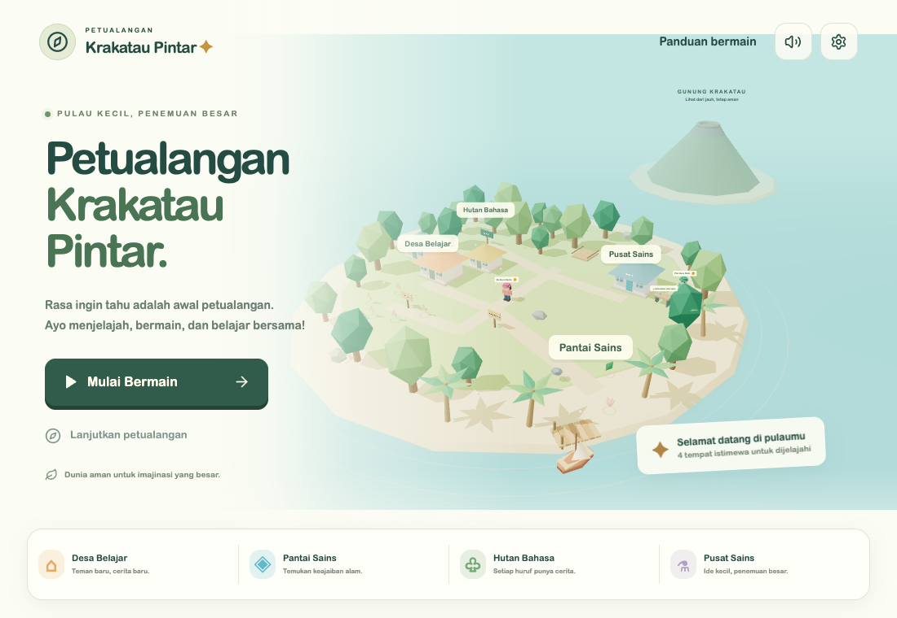
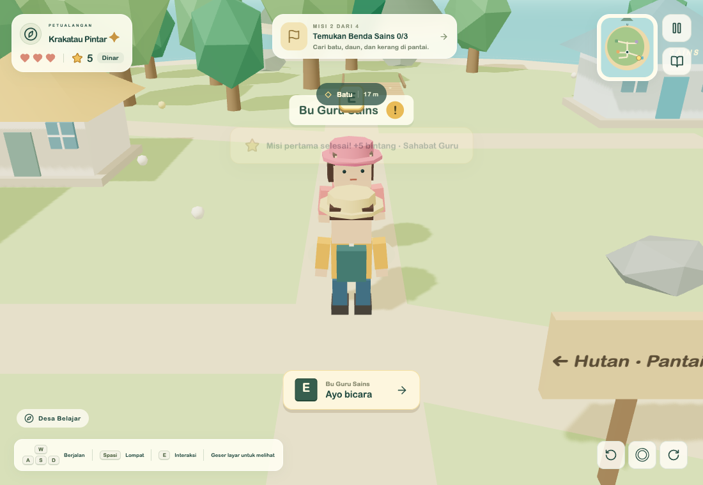
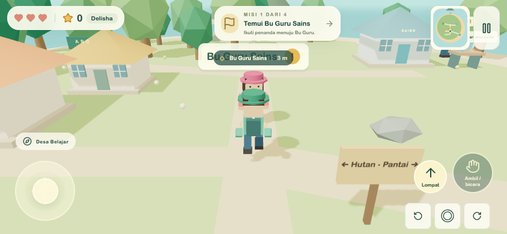
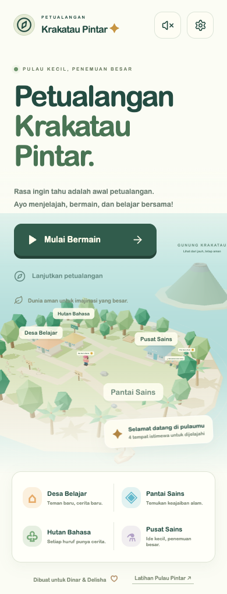

# Laporan implementasi Petualangan Krakatau Pintar

Tanggal: 11 September 2026.

## Hasil

Mode sandbox 3D baru berada di `/`. Mode latihan terdahulu dipertahankan di `/classic/`, termasuk konten, penyimpanan, PIN, timer, panel orang tua, audio TTS, dan tesnya. Bookmark rute lama dialihkan ke mode latihan. React 19.2.8, Three.js 0.186, React Three Fiber 9.7, dan Drei 10.7 digunakan dengan lockfile npm.

Dua profil memiliki progres tersendiri dan tepat tiga avatar 3D dapat dipilih. Kamera mengikuti pemain dari belakang; tersedia gerak keyboard/joystick, lompat, rotasi kamera, batas pulau, dan collision. Interaksi memerlukan jarak dekat. Semua panel menghentikan simulasi dan pindah tab membuka pause.

Empat misi utama berfungsi, dengan kuis sesuai profil, retry dan penjelasan, 28 bintang total, empat lencana, serta unlock Klub Peneliti Kecil. Laboratorium memiliki NPC tambahan dan latihan bergilir. Progres tersimpan pada localStorage; data mode lama tidak diubah. Tidak ada backend, login, chat, iklan, atau pembelian.

## Pemeriksaan

- `npm run lint`: lulus.
- `npm run typecheck`: lulus.
- `npm test`: **55 tes lulus**, termasuk 47 tes lama dan 8 tes aturan misi/penyimpanan/collision baru.
- `npm run build`: lulus. Output `dist`; chunk 3D sekitar **975 kB minified / 264 kB gzip**. Ada peringatan ukuran chunk Vite, tanpa error build.
- Playwright: **40 skenario terverifikasi lulus**. Sebanyak 36 skenario regresi mode latihan lulus pada suite penuh; empat skenario 3D lulus pada eksekusi terakhir (`npm run test:e2e -- e2e/adventure.spec.ts`, 1,1 menit). Console error dan page error pada perjalanan 3D lengkap kosong. Ikon tab lokal ditambahkan untuk menghilangkan 404 favicon.

Perbaikan yang diverifikasi: kesiapan kontrol sebelum input pertama, grid avatar pada mobile landscape, dialog yang mengikuti state React, dan pemuatan layar latihan ketika clock pengujian dibekukan. Aturan timer lama tidak diubah.

### Bukti browser

Tes perjalanan Dinar berjalan melalui keyboard, bukan teleport atau injeksi posisi. Pemain bertemu guru, mengambil tiga benda, menjawab salah lalu mencoba lagi, menyusun BUKU, mengumpulkan lima bintang, menyelesaikan hitungan, dan memperoleh 28 bintang/empat lencana. Reload memulihkan progres. Latihan laboratorium berikutnya menguji pengurangan dan perkalian dengan tambahan hadiah.

Tes mobile menggunakan Chrome dengan emulasi touch landscape 844 × 390, memilih avatar ahli alam, menggerakkan joystick melalui pointer, menekan lompat dan reset kamera, membuka pause, serta berganti profil. Tes Delisha mencakup pencocokan gambar, retry, dan reset selektif. Tes portrait memeriksa overflow, tombol menu, mute setelah refresh, serta perlindungan data rusak.

## Batas validasi

Belum diuji pada perangkat fisik anak, Safari/Firefox, screen reader, atau production Vercel. Audio dibuat secara procedural tanpa musik/narasi. PIN dan batas waktu mode 2D belum mengendalikan mode 3D; cakupan itu ditampilkan pada pengaturan dan README. Gunakan satu tab 3D agar penulisan localStorage bersamaan tidak berkonflik. Tidak ada cloud sync; posisi pemain kembali ke desa saat melanjutkan.

Fase berikutnya: uji kegunaan bersama anak, integrasi timer/panel orang tua lintas mode, narasi Indonesia, variasi konten, dan backup progres.
